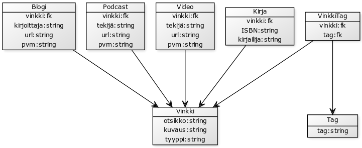

# tietokantakaavio.png



* Implisiittiset ID:t kaikilla.
* Foreign keyt viittaavat nuolen osoittamaan tauluun.

## Käyttö

* Jokainen vinkki on sekä Vinkki-taulussa, että jossain muussa (esim. Krija).
* Haussa yhdistetään Vinkki-taulun tietoihin toisen taulun tiedot.
* Poistettaessa poistettava molemmista tauluista.

## Esimerkki-inserttejä.

* Kirja:
  * otsikko = "ots"
  * kuvaus = "kuv"
  * ISBN = "isbn"
  * kirjailija = "kirjailija"

```
INSERT INTO Vinkki (otsikko, kuvaus, tyyppi) VALUES ("otsikko","kuvaus", "kirja");
INSERT INTO Kirja (vinkki, ISBN, kirjailija) VALUES ((SELECT vinkki_id FROM Vinkki ORDER BY vinkki_id DESC LIMIT 1),"isbn" ,"kirjailija");
tagit
```

* Video:
  * otsikko = "ots"
  * kuvaus = "kuv"
  * tekijä = "tekija"
  * url = "url"
  * pvm = "pvm"

```
INSERT INTO Vinkki (otsikko, kuvaus, tyyppi) VALUES ("otsikko","kuvaus", "video");
INSERT INTO Video (vinkki, tekija, url, pvm) VALUES ((SELECT vinkki_id FROM Vinkki ORDER BY vinkki_id DESC LIMIT 1),"tekija", "url", "pvm");
tagit
```

* Blogi:
  * otsikko = "ots"
  * kuvaus = "kuv"
  * kirjoittaja = "kirjoittaja"
  * url = "url"
  * pvm = "pvm"

```
INSERT INTO Vinkki (otsikko, kuvaus, tyyppi) VALUES ("otsikko","kuvaus", "blogi");
INSERT INTO Blogi (vinkki, kirjoittaja, url, pvm) VALUES ((SELECT vinkki_id FROM Vinkki ORDER BY vinkki_id DESC LIMIT 1),"kirjoittaja", "url", "pvm");
tagit
```

* Podcast:
  * otsikko = "ots"
  * kuvaus = "kuv"
  * tekijä = "tekija"
  * url = "url"
  * pvm = "pvm"

```
INSERT INTO Vinkki (otsikko, kuvaus, tyyppi) VALUES ("otsikko","kuvaus", "podcast");
INSERT INTO Podcast (vinkki, tekija, url, pvm) VALUES ((SELECT vinkki_id FROM Vinkki ORDER BY vinkki_id DESC LIMIT 1),"tekija", "url", "pvm");
tagit
```

* Tag:
  * tag = "tagi"

Kirjoita nämä muiden lauseiden jälkeen kohtaan "tagit".

uusi tagi:

```
INSERT INTO Tag (tag) VALUES ("tagi");
INSERT INTO VinkkiTag (vinkki, tag) VALUES ((SELECT vinkki_id FROM Vinkki ORDER BY vinkki_id DESC LIMIT 1),(SELECT tag_id FROM Tag ORDER BY tag_id DESC LIMIT 1));
```

olemassa oleva tagi:

```
INSERT INTO VinkkiTag (vinkki, tag) VALUES ((SELECT vinkki_id FROM Vinkki ORDER BY vinkki_id DESC LIMIT 1),(SELECT tag_id FROM Tag WHERE tag = "tagi" LIMIT 1));
```
